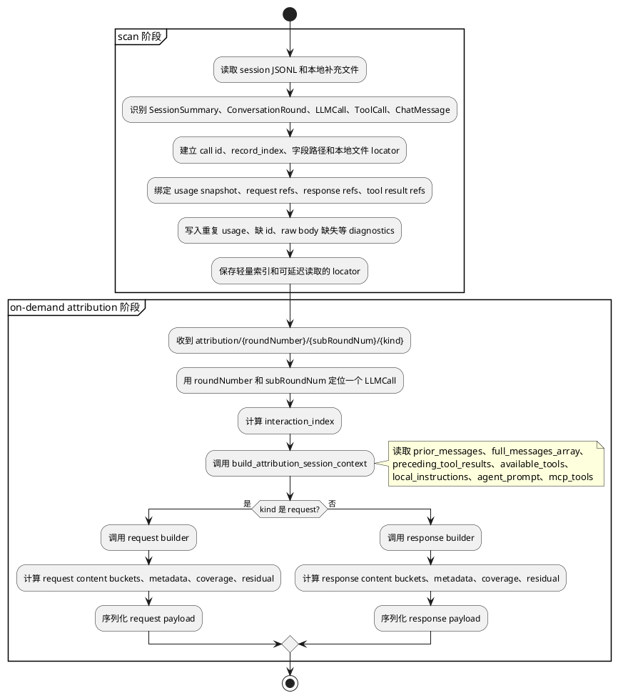

# Agent Token Attribution 规约

## 用途

本目录定义 token 提取、LLM call 边界、request/response 归因和 API payload 输出规则。后续实现必须以这些文件为 review 边界。

## 适用 Agent

| Agent | 文件 | Runtime key | API family | Provider/Broker |
|---|---|---|---|---|
| Claude Code | `claude-code.md` | `claude_code` | `anthropic_messages` | `anthropic` |
| Codex | `codex.md` | `codex` | `openai_responses` | `openai` |
| Qoder | `qoder.md` | `qoder` | `qoder_broker` | `qoder` |

未知 agent 只能走 fallback；不得套用上述三类 agent 的细则。

## 归因对象模型

| 对象 | 解释什么 | 是否参与 token 分布 |
|---|---|---|
| `request.content_buckets` | `Fresh` 输入 token 来自哪些内容来源。 | 是 |
| `request.metadata` | 请求配置、缓存控制、身份、非归因事件等辅助信息。 | 否 |
| `response.content_buckets` | `Output` 输出 token 来自哪些模型输出内容。 | 是 |
| `response.metadata` | 响应状态、引用、加密 reasoning 绑定、provider 侧工具计数等辅助信息。 | 否 |

metadata 不是 bucket。它必须保留在 payload 中供 review，但不进入 coverage、percent、residual 计算。

## 术语

| 术语 | 含义 |
|---|---|
| LLM call | 一次实际模型请求/响应。token、request 归因、response 归因都必须挂到具体 LLM call。 |
| content bucket | 一组同类 token 来源。bucket 不是原始 JSONL 字段，也不是 UI 卡片。 |
| 原始绑定路径 | 实现必须读取的原始 session JSONL 字段路径，或明确列出的本地补充来源路径。不能从 UI 文案反推。 |
| 估算策略 | 历史实现曾使用 reported/estimated/heuristic/residual/unavailable 等标签；当前 normalized scan artifact 和默认 API payload 不再逐字段暴露 `precision`。 |
| residual | 已知 content bucket 解释后剩余的 token。只能作为“未定位”展示，不得编造来源。 |

## 固定不变的规则

| 固定项 | 不变的内容 |
|---|---|
| LLM call 边界 | 先确定逻辑 LLM call，再归属 token 和内容；UI round、可见 assistant 文本、phase 不得改变 token 边界。 |
| 五字段 | UI tokenbar 固定为 `Fresh`、`Cache Read`、`Cache Write`、`Output`、`Total`。 |
| Total 公式 | `Total = Fresh + Cache Read + Cache Write + Output`。provider raw total 只能作诊断或 fallback。 |
| Fresh 语义 | `Fresh` 是互斥的新输入分段。OpenAI/Codex 这类 cache read 属于 input 子集时，`Fresh = input_tokens - cached_input_tokens`。 |
| Request Content Denominator | request content bucket percent、coverage、unlocated residual 的分母固定为 `Fresh`。 |
| Response denominator | response content bucket percent、coverage、unlocated residual 的分母固定为 `Output`。 |
| Cache 角色 | `Cache Read` 和 `Cache Write` 只表示 provider/broker accounting；不得生成 `provider_cached_context` 内容 bucket。 |
| Config 角色 | `model`、`max_tokens`、`stream`、`thinking`、`output_config`、`context_management`、`cache_control` 等进入 metadata，不进入 content bucket。 |
| Request/Response 分离 | tool schema、tool result 属于 request；tool call 属于 response；同一内容不得两侧重复计数。 |
| Tool call 粒度 | response 只保留一个 `tool_call` bucket；单个工具调用放在 `items[]`。 |
| 多片段 usage | 同一 LLM call 内先选一个 request input snapshot，再选一个 accounting snapshot；不得逐字段取最大值拼成不存在的 usage。 |
| 不可见内容 | hidden prompt、encrypted reasoning、provider state 只能说明存在、估算或不可得；不得展示伪造原文。 |
| 占位符 tag | `<id>`、`<url>`、`<dir>`、`<missing>` 等正文占位符继承父内容 bucket，不创建新 bucket。 |
| 脱敏 | 展示全文或 preview 前必须脱敏 secret、token、password、API key。 |

## 全局阶段边界

### Scan 阶段只做映射

| 必须做 | 说明 |
|---|---|
| 识别 session、round、LLM call | 产出稳定 `LLMCall` 顺序、id、时间、agent、usage snapshot 绑定。 |
| 记录原始来源引用 | 保存 JSONL `record_index`、字段路径、本地补充文件 locator。 |
| 建立不确定关系映射 | 例如 user/tool_result 属于哪个下一次 call，assistant fragment 属于哪个 call。 |
| 记录轻量诊断 | 重复 usage、缺 id、usage 冲突、raw body 缺失。 |
| 保留延迟计算材料 | 缓存或定位 raw request、response、tool outputs、global instruction refs。 |

### Scan 阶段不得做

| 禁止项 | 原因 |
|---|---|
| 计算最终 content bucket token 分布 | 分布依赖点击 request/response 时的 call-scoped context。 |
| 计算 coverage、residual、share | 分母和 bucket 明细由按需 builder 决定。 |
| 展开大段工具 schema、项目指令全文做 token 估算 | 这是按需成本，scan 只保存 locator。 |
| 把 config 归一化成 bucket | config 永远是 metadata，按需 payload 输出即可。 |
| 猜不可见 hidden prompt 原文 | scan 只能记录存在性或 residual 诊断。 |

## Normalized Scan Artifact

normalized artifact 是 scan 阶段落盘的轻量中间结果，不是 request/response attribution payload。它只保存重新定位 raw JSONL 所需的事实：

```jsonc
{
  "schema_version": "session-detail.normalized.v2", // 当前唯一支持版本，只用于判断 artifact 是否需要重建
  "agent": "claude_code", // claude_code | codex | qoder
  "source": {
    "files": [
      {
        "role": "main_session", // main_session | subagent_session | codex_rollout
        "path": "docs/session-samples/.../<session-id>.jsonl",
        "subagent_id": "child", // 仅 subagent 文件需要
        "parent_tool_use_id": "toolu_agent_1" // 仅 subagent 文件需要
      }
    ]
  },
  "session": {
    "session_key": "claude_code:<session-id>",
    "session_id": "<session-id>",
    "title": "短标题",
    "model": "qwen3.7-plus",
    "cwd": "/repo",
    "started_at": "2026-06-13T07:26:41Z",
    "ended_at": "2026-06-13T07:30:48Z",
    "git_branch": "main",
    "source": "cli",
    "project_key": "-Users-...",
    "project_name": "-Users-..."
  },
  "calls": [
    {
      "call_id": "msg_x",
      "call_index": 1,
      "call_key": "C1",
      "scope": "main",
      "parent_call_id": "",
      "parent_tool_call_id": "",
      "turn_id": "",
      "model": "qwen3.7-plus",
      "timestamp": "2026-06-13T07:26:49Z",
      "usage": {
        "fresh": 24572,
        "cache_read": 0,
        "cache_write": 26091,
        "output": 134,
        "total": 50797
      },
      "request": {
        "tool_result_ids": []
      },
      "response": {
        "tool_call_ids": ["toolu_x"]
      }
    }
  ],
  "tool_executions": [
    {
      "tool_call_id": "toolu_x",
      "name": "Read",
      "scope": "main",
      "declared_by_call_id": "msg_x",
      "result_consumed_by_call_id": "msg_y"
    }
  ],
  "diagnostics": []
}
```

`usage_source` 只在 `usage` 为本地估算时出现；未出现表示 usage 来自 agent JSONL/provider usage snapshot。当前估算值仍写入同一个五字段 `usage` 账本，因此 `usage.total` 也可能是估算值，必须通过 `usage_source.kind=estimated` 判断：

```jsonc
{
  "call_id": "55f29295-0034-44a0-97f0-e8f35e9bdf7f",
  "usage": {
    "fresh": 11,
    "cache_read": 0,
    "cache_write": 0,
    "output": 26,
    "total": 37
  },
  "usage_source": {
    "kind": "estimated",
    "method": "chars_div_4",
    "reason": "provider_usage_missing"
  }
}
```

normalized artifact 明确不保存这些可派生或高成本字段：`context_sources`、`payload_index`、`diagnostics.token_timeline`、`parse_diagnostics`、`request/response.availability`、`content_refs`、`payload_ref`、`token_source_ref`、`token_sources`、`source_refs`、`precision`、`preview`、`tool_executions[].type`、默认 `tool_executions[].status=completed`、默认 `exit_code=0`、工具入参正文和工具结果正文。

`agent_bucket` 是旧实现里 agent 原生 bucket 名；`canonical_category` 是跨 agent 统一后的 bucket 名。v2 scan artifact 不再保存二者，因为 content bucket 只在 on-demand attribution 阶段计算。on-demand payload 统一使用下文候选值中的 `key`。

### Attribution 接口阶段才做计算

当 UI 调用 `attribution/{roundNumber}/{subRoundNum}/request` 或 `attribution/{roundNumber}/{subRoundNum}/response` 时才执行：

| 必须做 | 说明 |
|---|---|
| 解析目标 call | 用 `roundNumber` 和 `subRoundNum` 定位 scan 阶段建立的 `LLMCall`。 |
| 构建 call-scoped context | 调用 `build_attribution_session_context`，取本 call 前的消息、工具结果、工具定义、项目指令、MCP 信息。 |
| 选择 agent builder | `claude_code`、`codex`、`qoder` 使用专用 builder；未知 agent 走 fallback。 |
| 计算 request/response bucket | 只计算当前接口需要的一侧；另一侧不应顺带计算。 |
| 生成 payload | 计算 tokens、share、coverage、residual、source_refs、items、metadata、diagnostics。 |

## 全局流程



## Request Attribution 候选值

### Request Content Buckets

| 一级分类 | key | 中文 label | 进入该类的内容 | 样例 |
|---|---|---|---|---|
| 对话输入 | `current_user_input` | 当前用户输入 | 当前 LLM call 的用户直接输入。 | Codex `event_msg.user_message.message`；Claude user `message.content`。 |
| 对话输入 | `user_attachments` | 用户附件/多模态输入 | 用户随请求提供的图片、文件、text element、附件正文。 | Codex `images/local_images/text_elements`；Claude 用户附件。 |
| 对话输入 | `conversation_messages` | 对话消息上下文 | 当前 call 前发送给模型的历史 user/assistant/tool_use/tool_result 消息。 | Anthropic `messages[]`；OpenAI `input[]` 历史 item。 |
| 对话输入 | `tool_result_context` | 工具结果上下文 | 已返回并会进入本次 request 的工具结果。 | Claude `message.content[type=tool_result]`；Codex `function_call_output`。 |
| 对话输入 | `repository_file_context` | 仓库/文件上下文 | 明确发送给模型的代码、diff、文件片段、搜索结果、目录信息。 | tool result 中的文件内容；`request_full` 中的 file context。 |
| 工具与能力 | `tool_definitions` | 工具定义 | tools/function schema、参数结构、工具描述。 | Claude request `tools[]`；Codex dynamic tool schema。 |
| 工具与能力 | `mcp_tool_metadata` | MCP 工具元数据 | MCP server/tool 名称、描述、连接信息。 | `mcp_tools`、`mcp_servers`。 |
| 工具与能力 | `skill_plugin_catalog` | Skill/Plugin 能力目录 | skill、plugin、slash command、agent capability 列表和使用规则。 | Claude `<system-reminder>` skill list；Codex `<skills_instructions>`、`<plugins_instructions>`。 |
| 指令与策略 | `platform_default_instructions` | 平台默认指令 | agent 产品默认身份、安全和基础行为规则；来源是平台，不是项目或本轮用户。 | Claude system `You are Claude Code...`；Codex `base_instructions.text`。 |
| 指令与策略 | `session_injected_instructions` | 会话注入指令 | 本次 session 外层注入的 developer/system 规则；来源是运行时、harness、用户给 agent 的边界。 | Codex `role=developer` 中非 app/skill/env 的规则。 |
| 指令与策略 | `project_instruction_files` | 项目指令文件 | repo 或用户 home 下维护的规则文件内容。 | `AGENTS.md`、`CLAUDE.md`、Qoder rules、`<INSTRUCTIONS>`。 |
| 指令与策略 | `custom_agent_profile` | Custom Agent 角色提示 | 自定义 agent/subagent 的角色定义和专用 prompt。 | `.claude/agents/{agent}.md`；subagent prompt。 |
| 指令与策略 | `hidden_instruction_estimate` | 隐藏指令估算 | 只知道存在、没有原始绑定路径的隐藏指令或平台 prompt。 | cache/residual 推断的 hidden prompt。 |
| 运行上下文 | `permission_sandbox_policy` | 权限/沙箱策略 | 文件系统、网络、approval、permission mode 等运行约束。 | `<permissions instructions>`、`permission_profile`、`permission-mode`。 |
| 运行上下文 | `client_app_context` | 客户端应用上下文 | Codex/Claude/Qoder 客户端能力、渲染、Git 指令、桌面环境说明。 | Codex `<app-context>`。 |
| 运行上下文 | `collaboration_mode_policy` | 协作模式规则 | Plan/Default、goal、handoff、继续执行等交互模式规则。 | Codex `<collaboration_mode>`。 |
| 运行上下文 | `runtime_environment_context` | 运行环境上下文 | 当前运行环境事实，不是业务文件内容。 | `<environment_context>` 中 `cwd/shell/current_date/timezone/filesystem/workspace_roots/root`。 |
| 运行上下文 | `task_goal_context` | 任务目标/续跑上下文 | goal、objective、continuation、上轮摘要中必须带入本 call 的任务状态。 | `<codex_internal_context>`、`<objective>`、goal continuation。 |
| 残差 | `unlocated_residual` | 未定位 | `Fresh - sum(known request content bucket tokens)` 后仍无法解释的部分。 | 无直接原始路径。 |

`captured_runtime_context` 不再作为候选值使用。原先混在里面的内容拆成 `repository_file_context`、`runtime_environment_context`、`client_app_context`、`task_goal_context`。

### 指令与策略边界

同一段内容只能进一个指令类 bucket，按以下顺序判定：

| 优先级 | 分类 | 判定依据 |
|---|---|---|
| 1 | `hidden_instruction_estimate` | 没有原始绑定路径，只能从 cache/residual 推断存在。 |
| 2 | `custom_agent_profile` | 来源是 custom agent/subagent profile 文件或 subagent prompt。 |
| 3 | `project_instruction_files` | 来源可定位到 repo/home 规则文件，例如 `AGENTS.md`、`CLAUDE.md`。 |
| 4 | `platform_default_instructions` | 来源是产品默认系统提示或 base prompt。 |
| 5 | `session_injected_instructions` | 来源是本次 session 注入的 developer/system 规则，且不属于以上类别。 |

`system` / `developer` 只是 API role，不直接决定分类；分类按来源和用途决定。

### Request Metadata

这些字段必须保留在 payload 中，但不参与 request 内容分布，也不消耗 `Fresh` 的 bucket coverage。

| metadata key | 内容 | 样例 |
|---|---|---|
| `model_config` | 模型、输出上限、stream、effort、reasoning/thinking 配置。 | Claude `model/max_tokens/stream/thinking/output_config`；Codex `model`。 |
| `context_management` | 上下文保留、清理、压缩策略。 | Claude `context_management.edits[].type=clear_thinking_20251015`。 |
| `cache_control` | 哪些 block 可缓存、缓存类型。 | Claude `system[].cache_control`、message block `cache_control`。 |
| `request_identity` | session、user、device、account、request id。 | Claude request `metadata.user_id`。 |
| `provider_state` | 服务端会话引用。 | OpenAI `previous_response_id`。 |
| `usage_metadata` | provider 上报但不属于内容分布的计费/运行元数据。 | `service_tier`、`cache_creation`、`inference_geo`、`speed`、`rate_limits`、`model_context_window`。 |
| `non_attribution_events` | 影响 trace 或标题但不解释 token 的事件。 | `ai-title`、`last-prompt`、`file-history-snapshot`、`thread_goal_updated`。 |

## Response Attribution 候选值

### Response Content Buckets

| key | 中文 label | 进入该类的内容 | 参与分布 |
|---|---|---|---|
| `assistant_text` | 助手文本 | 模型返回给用户可见的自然语言文本。 | 是 |
| `assistant_thinking` | 可见 thinking 文本 | 本地日志可见且字段类型明确为 thinking/thought 的内容。 | 是 |
| `tool_call` | 工具调用结构 | 模型输出的 tool/function call 名称、参数和结构化调用体；单个调用放 `items[]`。 | 是 |
| `hidden_reasoning` | 隐藏推理输出 | provider 上报的 hidden reasoning token、encrypted reasoning 或不可见 thinking。 | 是 |
| `structured_response_block` | 结构化响应块 | 作为 assistant 输出正文出现的结构化块。 | 是 |
| `unlocated_residual` | 未定位输出 | `Output - sum(known response content bucket tokens)` 后剩余部分。 | 是 |

### Assistant Text 与 Thinking 边界

| 分类 | 判定依据 |
|---|---|
| `assistant_text` | 原始字段类型是 `text`、`output_text`、`agent_message`，或作为最终用户可见回答展示。 |
| `assistant_thinking` | 原始字段类型是 `thinking`、`thought`，本地日志可见，但不是用户最终回答正文。 |
| `hidden_reasoning` | 只有 token、summary、encrypted reference，没有可展示原文。 |

二者是否“看起来像一句话”不作为判定依据。若某段 thinking 和 assistant text 内容相同，仍按原始字段类型归类；UI 可合并展示，但 attribution 不合并来源。

### Response Metadata

这些字段描述 response 的状态或引用关系，不参与 `Output` 内容分布。

| metadata key | 内容 | 样例 |
|---|---|---|
| `response_status` | stop/finish/status/phase。 | Claude `stop_reason`；Codex `phase`、`status`。 |
| `reasoning_reference` | 有 encrypted reasoning 或 summary，但不可展示原文。 | Codex `response_item.reasoning.encrypted_content`。 |
| `provider_tool_use_metadata` | provider 侧 server tool use 计数，不等于本地工具调用。 | Claude usage `server_tool_use.web_search_requests`。 |
| `citation_metadata` | 引用结构本身和引用解析状态。 | `<oai-mem-citation>`、`<citation_entries>`、`<rollout_ids>`。 |

如果 `<oai-mem-citation>` 是 assistant 最终回答正文的一部分，它的可见 token 进入 `structured_response_block`；解析状态进入 `citation_metadata`。

## API Payload 要求

接口一次只返回 `kind` 指定的一侧：`/request` 只返回 `request`，`response=null`；`/response` 只返回 `response`，`request=null`。不得为了一个按钮顺带计算另一侧。

```jsonc
{
  "kind": "request", // request | response，必须和路由 kind 一致
  "call_id": "llm-R1-C1", // 全局唯一 LLM call id
  "agent": "codex", // claude_code | codex | qoder
  "api_family": "openai_responses",
  "provider": "openai",
  "source": {
    "session_file": "/abs/path/session.jsonl",
    "raw_body_available": false,
    "build_stage": "on_demand_attribution"
  },
  "usage": {
    "fresh": 29973,
    "cache_read": 2432,
    "cache_write": 0,
    "output": 574,
    "total": 32979
  },
  "request": {
    "content_bucket_candidates": [
      "current_user_input",
      "user_attachments",
      "conversation_messages",
      "tool_result_context",
      "repository_file_context",
      "tool_definitions",
      "mcp_tool_metadata",
      "skill_plugin_catalog",
      "platform_default_instructions",
      "session_injected_instructions",
      "project_instruction_files",
      "custom_agent_profile",
      "hidden_instruction_estimate",
      "permission_sandbox_policy",
      "client_app_context",
      "collaboration_mode_policy",
      "runtime_environment_context",
      "task_goal_context",
      "unlocated_residual"
    ],
    "content_buckets": [
      {
        "key": "current_user_input", // 必须来自上方候选值
        "label": "当前用户输入",
        "tokens": 1200,
        "share": 0.04, // tokens / usage.fresh
        "participates_in_distribution": true,
        "source_refs": [
          {
            "path": "event_msg.payload.message",
            "record_index": 4
          }
        ],
        "items": [
          {
            "label": "user message",
            "tokens": 1200,
            "source_ref_index": 0
          }
        ]
      }
    ],
    "metadata_candidates": [
      "model_config",
      "context_management",
      "cache_control",
      "request_identity",
      "provider_state",
      "usage_metadata",
      "non_attribution_events"
    ],
    "metadata": {
      "model_config": {
        "model": "gpt-5",
        "max_tokens": null,
        "stream": null
      },
      "cache_control": {
        "source_refs": []
      },
      "provider_state": {
        "previous_response_id": null
      },
      "usage_metadata": {
        "raw_total_tokens": 32979,
        "model_context_window": 258400
      }
    },
    "coverage": {
      "known_tokens": 28000,
      "residual_tokens": 1973,
      "coverage_ratio": 0.934
    }
  },
  "response": null,
  "diagnostics": [
    {
      "code": "duplicate_token_count",
      "severity": "info",
      "message": "重复累计快照，贡献 0",
      "source_refs": []
    }
  ]
}
```

`/response` payload 结构相同，但 `kind="response"`、`request=null`，`response.content_bucket_candidates` 固定使用 `assistant_text`、`assistant_thinking`、`tool_call`、`hidden_reasoning`、`structured_response_block`、`unlocated_residual`；`response.metadata_candidates` 固定使用 `response_status`、`reasoning_reference`、`provider_tool_use_metadata`、`citation_metadata`。

### Payload 字段说明

| 字段 | 必填 | 说明 |
|---|---|---|
| `kind` | 是 | `request` 或 `response`；必须和路由 kind 一致。 |
| `call_id` | 是 | 归因单元 id，必须对应一个 LLM call。 |
| `source.build_stage` | 是 | 固定为 `on_demand_attribution`；表示 payload 不是 scan 阶段产物。 |
| `usage` | 是 | 五字段和分母定义；UI tokenbar 只读这里，不暴露 `precision`。 |
| `request` | 条件必填 | `kind=request` 时必填；`kind=response` 时必须为 `null`。 |
| `request.content_bucket_candidates` | 条件必填 | 当前规约允许的 request content bucket 枚举。 |
| `request.content_buckets[].key` | 条件必填 | 必须来自 request candidate。 |
| `request.content_buckets[].tokens` | 条件必填 | 该 bucket token 数；不能超过分母后静默截断，异常写 diagnostics。 |
| `request.content_buckets[].share` | 条件必填 | `tokens / usage.fresh`。 |
| `request.metadata_candidates` | 条件必填 | 当前规约允许的 request metadata 枚举。 |
| `request.metadata` | 条件必填 | 非分布字段；不得参与 coverage。 |
| `request.coverage` | 条件必填 | 只按 request content bucket 计算。 |
| `response` | 条件必填 | `kind=response` 时必填；`kind=request` 时必须为 `null`。 |
| `response.content_bucket_candidates` | 条件必填 | 当前规约允许的 response content bucket 枚举。 |
| `response.content_buckets[].key` | 条件必填 | 必须来自 response candidate。 |
| `response.content_buckets[].tokens` | 条件必填 | 该 bucket token 数；不能超过分母后静默截断，异常写 diagnostics。 |
| `response.content_buckets[].share` | 条件必填 | `tokens / usage.output`。 |
| `response.metadata_candidates` | 条件必填 | 当前规约允许的 response metadata 枚举。 |
| `response.metadata` | 条件必填 | 非分布字段；不得参与 response coverage。 |
| `response.coverage` | 条件必填 | 只按 response content bucket 计算。 |
| `diagnostics` | 是 | 重复 usage、raw total 冲突、不可见内容、估算异常等。 |

### `source_refs` 与 `items` 展示规则

| 字段 | 用途 | UI 展示计划 |
|---|---|---|
| `source_refs[]` | 记录 bucket 证据来自哪个原始对象，不承载长正文。 | bucket header 展示 source chip；点击 chip 定位 Payload 原始片段或复制 locator。 |
| `source_refs[].path` | 原始 JSONL/本地补充来源路径。 | 展示为 monospace 字段路径，例如 `response_item.payload.arguments`。 |
| `source_refs[].record_index` | 原始对象序号。 | 用于 Payload tab 跳转，不作为用户主要阅读内容。 |
| `source_refs[].line` | 原始文件行号，能定位时提供。 | 有行号时优先显示 `line <n>`。 |
| `source_refs[].role` | 来源角色或方向。 | 示例：`user`、`assistant`、`developer`、`tool_result`。 |
| `items[]` | bucket 内的可读明细行，承载 drilldown 内容。 | bucket 展开后以 compact table 展示。 |
| `items[].label` | 明细名称。 | 第一列，例如 tool name、message role、tag name。 |
| `items[].tokens` | 明细 token 数。 | 右对齐显示；bucket tokens 必须等于 items 合计或写明 residual。 |
| `items[].source_ref_index` | 指向 `source_refs[]` 的下标。 | UI 用它把明细行和原始来源 chip 关联。 |

## Review 检查

| 检查项 | 必须满足 |
|---|---|
| 字段来源 | 每个 token 字段都写清原始 session JSONL/本地绑定路径。 |
| 字段公式 | `Fresh`、cache、output、total 的公式不互相重复计数。 |
| config | 所有 config 进入 metadata，不进入 content bucket。 |
| tag | 语义 tag 映射到明确 bucket 或 metadata；占位符 tag 继承父 bucket。 |
| 指令类 | 同一段指令按“隐藏 > custom agent > 项目文件 > 平台默认 > 会话注入”只归一类。 |
| call 去重 | 重复 usage snapshot 不创建 LLM call，不贡献 token，只记录 diagnostics。 |
| raw payload 缺失 | 使用可见本地材料重建，并明确 `raw_body_available=false`。 |
| 估算内容 | 所有 estimated/heuristic/residual 都可解释，不能伪造不可见原文。 |
