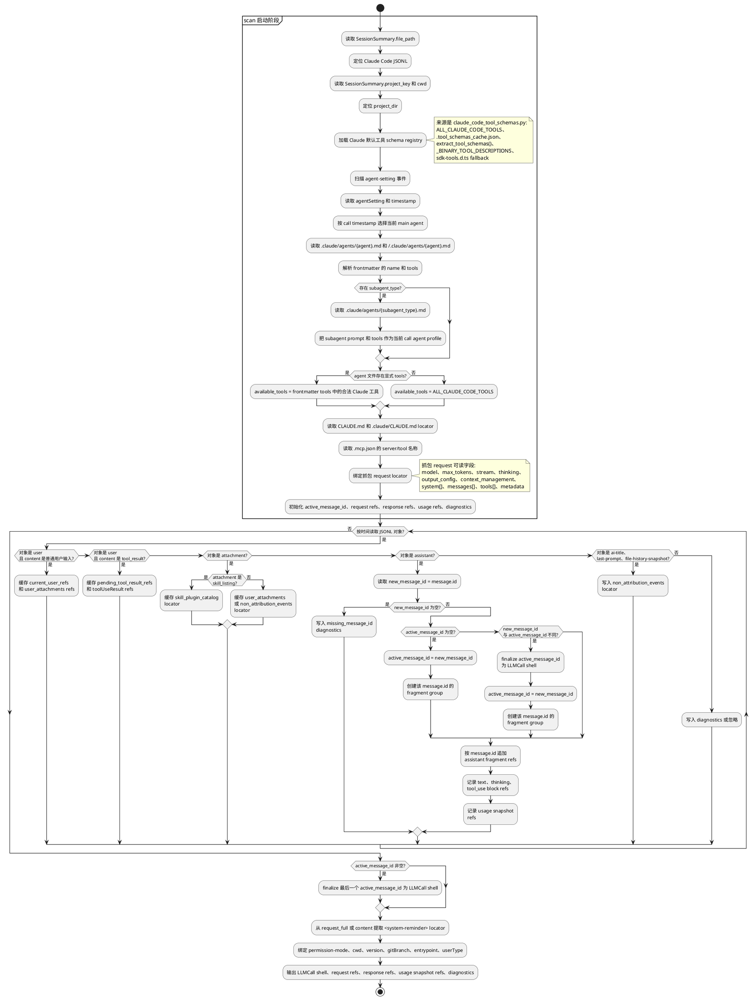
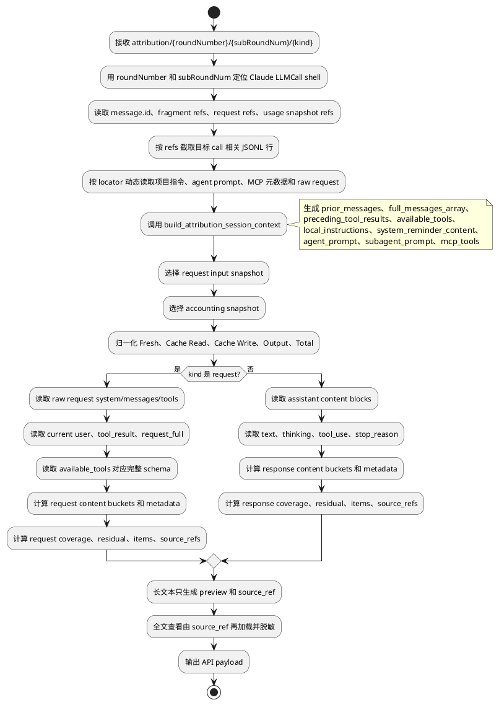

# Claude Code Token Attribution 规约

## 适用范围和判定入口

| 项 | 规约 |
|---|---|
| Runtime key | `claude_code` |
| API family | `anthropic_messages` |
| Provider | `anthropic` |
| 主数据源 | Claude Code JSONL；抓包 request 可补充 raw API body；subagent sidechain JSONL 单独解析。 |
| LLM call 判定 | assistant `message.id`；同 id fragments 合并为一个 LLM call。 |
| Raw body | 默认不可得；抓包 request 存在时优先使用 `system/messages/tools/metadata`。 |
| Subagent | sidechain 中的 LLM call 独立计数；父 session 未内联完整 subagent trace 时不判为数据缺失。 |

## Scan 阶段标准流程

### Scan 启动提取顺序

| 顺序 | 信息 | 来源路径 | 处理 |
|---|---|---|---|
| 1 | session 文件 | `SessionSummary.file_path` | 定位 Claude JSONL；后续 `record_index` 都以该文件行序为准。 |
| 2 | 项目目录 | `SessionSummary.project_key`、`SessionSummary.cwd`、JSONL top-level `cwd` | 作为读取项目指令、agent 文件、MCP 配置的根。 |
| 3 | 默认工具 schema | `src/session_browser/attribution/agents/claude_code_tool_schemas.py` 的 `ALL_CLAUDE_CODE_TOOLS`、`extract_tool_schemas()`、`.tool_schemas_cache.json` | 提供 Claude Code 默认 tools 完整列表和 schema token 估算；cache 缺失时回退 `_BINARY_TOOL_DESCRIPTIONS` / `sdk-tools.d.ts`。 |
| 4 | 当前 main agent | JSONL `type="agent-setting"` 的 `agentSetting`、`timestamp` | 选择目标 call 时间点之前最后一次 agent 设置。 |
| 5 | custom agent prompt/tools | `{project_dir}/.claude/agents/{agent}.md`、`~/.claude/agents/{agent}.md` | 解析 frontmatter `name:`、`tools:`；正文进入 `custom_agent_profile` locator。 |
| 6 | subagent prompt/tools | `{project_dir}/.claude/agents/{subagent_type}.md` | subagent route 才读取；覆盖 main agent profile。 |
| 7 | 项目指令 | `{project_dir}/CLAUDE.md`、`{project_dir}/.claude/CLAUDE.md` | 保存 locator；全文估算延迟到 on-demand。 |
| 8 | MCP 元数据 | `{project_dir}/.mcp.json` 的 `mcpServers` / `mcp_servers` | 只保留 server 名和 tool 名，不读取密钥值。 |
| 9 | 可见系统提示 | assistant `request_full` 或 message content 中的 `<system-reminder>...</system-reminder>` | scan 只保存 locator；分类延迟到 on-demand。 |
| 10 | 抓包 request | 外部 capture JSON 的 `model/system/messages/tools/metadata/context_management/cache_control` | 存在时作为 raw body 优先证据；不存在不阻断。 |

### `active_message_id` 规则

| 场景 | 处理 |
|---|---|
| 初始值 | 为空。 |
| 来源 | 当前 assistant JSONL 对象的 `message.id`，不是 UI round、timestamp 或文本内容。 |
| 创建 | 第一次读到非空 `message.id` 的 assistant 对象时创建 fragment group，并令 `active_message_id = message.id`。 |
| 追加 | 后续 assistant 对象 `message.id == active_message_id` 时追加到同一 LLM call。 |
| 切换 | 读到不同非空 `message.id` 时，先 finalize 旧 `active_message_id`，再创建新 group。 |
| 收尾 | 文件结束或 sidechain 结束时 finalize 最后一个非空 `active_message_id`。 |
| 缺失 | 写 `missing_message_id` diagnostics；只有能用相邻 raw request 明确绑定时才用顺序 fallback。 |

### Scan 输出

| 输出 | 内容 |
|---|---|
| `LLMCall shell` | call id、`message.id`、时间、model、stop_reason、usage snapshot refs。 |
| `request refs` | 当前用户输入、tool_result、附件、raw request、本地指令和 sidechain locator。 |
| `response refs` | assistant `text/thinking/tool_use` block locator。 |
| `diagnostics` | 缺 id、usage fragment 冲突、raw request 缺失、sidechain 断链。 |

Scan 不计算 bucket token、share、coverage、residual。

## On-demand Attribution 阶段标准流程

### On-demand 动态提取表

| 信息 | 动态读取来源路径 | 方法简述 | 截断/去重 |
|---|---|---|---|
| 目标 call | scan 输出的 `LLMCall.id == message.id`、`roundNumber/subRoundNum` | 只定位一个 call；不为其它 call 计算 bucket。 | 不跨 call 合并。 |
| 当前用户输入 | 当前 call 前缓存的 user refs；raw request `messages[]` 最后一个 user 段 | 优先 raw request；缺失时用 JSONL user `message.content[type=text]`。 | 和 `request_full` 中相同文本去重。 |
| 对话历史 | `build_attribution_session_context.full_messages_array`；raw request `messages[]` | 按 call 边界取当前 call 前历史。 | `content_preview` 200 字符；token 用全文估算。 |
| 工具结果 | user `message.content[type=tool_result]`、`toolUseResult`、`request_full` 中 `Tool result for ...` | 只取当前 call 之前已返回且会进入本次 request 的结果。 | 同一 `tool_use_id` 只计一次。 |
| 仓库/文件上下文 | `toolUseResult`、Read/Bash/Grep 输出、raw request `messages[]` 文件片段 | 按工具结果类型识别文件内容、diff、搜索结果、目录列表。 | 明细 preview 截断；全文由 source_ref 加载。 |
| 工具定义 | raw request `tools[]`；否则 `available_tools` + `claude_code_tool_schemas.py` | raw request 最优先；fallback 用默认 registry 取完整 schema token。 | 同名 tool 只计一次。 |
| Skill/Plugin 能力目录 | `<system-reminder>`、`attachment.type=skill_listing` | 识别 skill list、plugin list、slash command/capability 描述。 | 占位符 tag 不单独成 bucket。 |
| 平台默认指令 | raw request `system[]`；`<system-reminder>` 中 Claude Code 默认段 | 按来源归入 `platform_default_instructions`。 | 与项目指令、custom agent prompt 去重。 |
| 项目指令文件 | `CLAUDE.md`、`.claude/CLAUDE.md` | on-demand 读取 locator；分类为 `project_instruction_files`。 | context 默认保留 2048 字符预览；token 可按全文或可读切片估算。 |
| Custom Agent 角色提示 | `.claude/agents/{agent}.md`、`.claude/agents/{subagent_type}.md`、home agent 文件 | 读取 frontmatter 和正文；tools 只用于工具定义，正文归 profile。 | main/subagent 同时存在时以 subagent 当前 call 为准。 |
| MCP 元数据 | `.mcp.json` 的 server/tool 名 | 只输出名称和描述级信息。 | 不读取 command、env、token 等敏感值。 |
| 运行/权限上下文 | JSONL top-level `cwd/version/gitBranch/entrypoint/userType`、`permission-mode`、raw system 权限段 | 进入运行上下文 bucket 或 metadata。 | 不把配置字段计入 content bucket。 |
| request metadata | raw request `model/max_tokens/stream/thinking/output_config/context_management/cache_control/metadata` | 只输出 metadata。 | 不参与 coverage。 |
| assistant text | assistant `message.content[type=text].text`、`response_full` | 作为 response `assistant_text`。 | 与 mirror 文本去重。 |
| assistant thinking | assistant `message.content[type=thinking].thinking` | 字段类型明确才归入 thinking。 | 不因内容像回答而改类。 |
| tool call | assistant `message.content[type=tool_use].name/input/id` | 参数 JSON 估算 token；单个调用放 `items[]`。 | 同一 `tool_use.id` 只计一次。 |
| usage snapshot | assistant `message.usage` 同 id 多片段 | request input snapshot 和 accounting snapshot 分开选择。 | 禁止逐字段最大值拼 usage。 |

## Token 字段映射

| 字段 | 原始 session JSONL/本地绑定路径 | 标准取值 | 缺失/冲突处理 |
|---|---|---|---|
| LLM call key | assistant record 的 `message.id`。 | 同 id fragments 合并为一个 call。 | 无 id 时才用事件顺序 fallback，并写 diagnostics。 |
| Provider request input | assistant `message.usage.input_tokens`。 | provider 上报的 request input。 | 多 fragment 取同组最大非零 request input snapshot。 |
| `Fresh` | assistant `message.usage.input_tokens`。 | `input_tokens`。 | 无 usage 为 0/`unavailable`。 |
| `Cache Read` | `message.usage.cache_read_input_tokens`；兼容 `cached_input_tokens`。 | provider 原值。 | 0 是有效值；字段缺失才 `unavailable`。 |
| `Cache Write` | `message.usage.cache_creation_input_tokens`。 | provider 原值。 | 0 是有效值；字段缺失才 `unavailable`。 |
| `Output` | `message.usage.output_tokens`。 | provider 可见输出 token。 | response 文本估算只用于 bucket，不反写 provider output。 |
| `Total` | 归一化组件。 | `Fresh + Cache Read + Cache Write + Output`。 | 不用 provider raw total 覆盖组件和。 |

## Multi-fragment 合并

| 项 | 规约 |
|---|---|
| 分组 | 同一 assistant `message.id` 的 fragments 属于一个 LLM call。 |
| Request input snapshot | 取同组最大非零 `input_tokens`，避免 streaming 尾段覆盖真实输入。 |
| Accounting snapshot | `Cache Read`、`Cache Write`、`Output` 必须来自同一个 snapshot。 |
| Snapshot 优先级 | `Output > 0` > cache 字段存在 > 组件合计更大 > JSONL 中更晚。 |
| 禁止 | 不得对 `input/cache/output` 逐字段取最大值后拼出不存在的 usage。 |

## Request content bucket 提取规则

| 全局候选值 | Claude Code 提取规则 |
|---|---|
| 当前用户输入 | 从当前 call 对应 user message 或 raw request 当前用户段提取。 |
| 用户附件/多模态输入 | 从 top-level `attachment` 中用户上传文件/图片内容提取；`skill_listing` 不算用户附件。 |
| 对话消息上下文 | 按当前 LLM call 边界重建 Anthropic `messages`；避免和当前用户输入、工具结果重复计数。 |
| 工具结果上下文 | 从当前 call 前已返回、会进入本次 request 的 `tool_result` content 提取；`<tool_use_error>` 是错误子类型。 |
| 仓库/文件上下文 | 从 `toolUseResult`、Read/Edit/Bash 输出、文件内容、diff、搜索结果中提取。 |
| 工具定义 | 优先 raw request `tools[]`；缺失时用 call context `available_tools`、agent 显式 `tools:` 或 builtin tool registry。 |
| MCP 工具元数据 | 从 call context `mcp_tools` / `mcp_servers` 提取名称、server 和描述级信息。 |
| Skill/Plugin 能力目录 | 从 `<system-reminder>` skill list 或 `attachment.type=skill_listing` 提取。 |
| 平台默认指令 | 从 raw request `system[]` 中 Claude Code 默认身份、安全和基础行为提示提取。 |
| 会话注入指令 | 从 raw request `system[]` 中非平台、非本地文件、非权限的本次 session 规则提取。 |
| 项目指令文件 | 从 `<system-reminder>` 中 `claudeMd`、`CLAUDE.md`、项目规则内容提取。 |
| Custom Agent 角色提示 | 从 `.claude/agents/{agent}.md`、`~/.claude/agents/{agent}.md`、subagent prompt 提取。 |
| 隐藏指令估算 | 无原始绑定路径时只按 cache/residual 估算说明；不得展示伪造内容。 |
| 权限/沙箱策略 | 从 `permission-mode`、raw system 中权限/安全约束提取。 |
| 客户端应用上下文 | Claude Code 客户端能力说明存在时提取；没有则不产出。 |
| 协作模式规则 | Claude Code 明确注入 plan/loop/agent 协作规则时提取；没有则不产出。 |
| 运行环境上下文 | 从 top-level `cwd/version/gitBranch/entrypoint/userType` 和 raw request 环境字段提取。 |
| 任务目标/续跑上下文 | 从 task reminder、last-prompt、sidechain task prompt 提取；不把 `ai-title` 算内容。 |
| 未定位 | `Fresh - sum(known request content buckets)`，小于 0 时归零并写 diagnostics。 |

## Request metadata 提取规则

| metadata key | Claude Code 提取规则 |
|---|---|
| `model_config` | raw request `model/max_tokens/stream/thinking/output_config`。 |
| `context_management` | raw request `context_management`，例如 `clear_thinking_20251015`。 |
| `cache_control` | raw request `system[].cache_control` 和 message block `cache_control`。 |
| `request_identity` | raw request `metadata.user_id`、top-level `sessionId/promptId/uuid`。 |
| `provider_state` | Claude raw request provider state 字段存在时提取；通常不产出。 |
| `usage_metadata` | usage `server_tool_use/service_tier/cache_creation/inference_geo/iterations/speed`。 |
| `non_attribution_events` | `ai-title`、`last-prompt`、`file-history-snapshot`、空 task reminder。 |

## Response content bucket 提取规则

| 全局候选值 | Claude Code 提取规则 |
|---|---|
| 助手文本 | 从 assistant `message.content[type=text]` 或 `response_full` 提取。 |
| 可见 thinking 文本 | 从 assistant `message.content[type=thinking].thinking` 提取。 |
| 工具调用结构 | 从 assistant `message.content[type=tool_use]` 提取工具名和参数 JSON；单个调用放 `items[]`。 |
| 隐藏推理输出 | 默认不产出；只有 provider 明确上报 hidden thinking/reasoning token 时才产出。 |
| 结构化响应块 | Claude 可见结构化正文块存在时产出；工具调用不放这里。 |
| 未定位输出 | `Output - sum(known response content buckets)`，小于 0 时归零并写 diagnostics。 |

## Response metadata 提取规则

| metadata key | Claude Code 提取规则 |
|---|---|
| `response_status` | `stop_reason`、`stop_details`、assistant message type。 |
| `reasoning_reference` | thinking signature 或不可见 reasoning 引用存在时提取。 |
| `provider_tool_use_metadata` | usage `server_tool_use`，例如 web search/fetch request count。 |
| `citation_metadata` | Claude response 中出现结构化引用 tag 时提取；没有则不产出。 |

## 常见问题及处理

| 问题 | 判定 | 处理 |
|---|---|---|
| Fresh 变成很小 | 最后一个 streaming fragment 覆盖了完整 usage。 | 同 `message.id` 分组后取最大非零 request input snapshot。 |
| Cache 字段被拼错 | cache/output 分别从不同 fragment 取最大值。 | cache/output 必须来自同一个 accounting snapshot。 |
| `<thinking>` 被误判为响应 thinking | tag 出现在 tool description 示例里。 | 继承 `tool_definitions`，不创建 response thinking bucket。 |
| skill listing 被算成工具 schema | `<system-reminder>` 或 attachment 是 skill 列表。 | 归入 `skill_plugin_catalog`。 |
| config 被计入 bucket | `thinking/output_config/context_management/cache_control` 出现在分布里。 | 移入 request metadata。 |
| 隐藏 prompt 被展示成原文 | 本地日志没有 hidden prompt 全文。 | 只展示可见 `<system-reminder>` 或估算说明。 |
