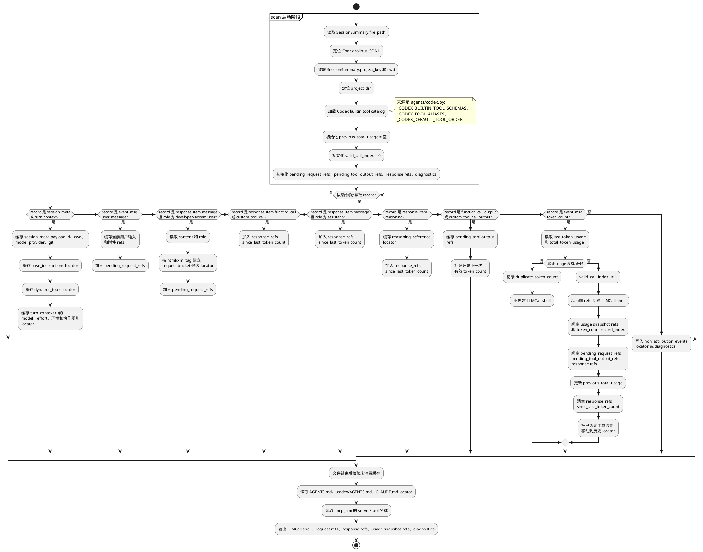
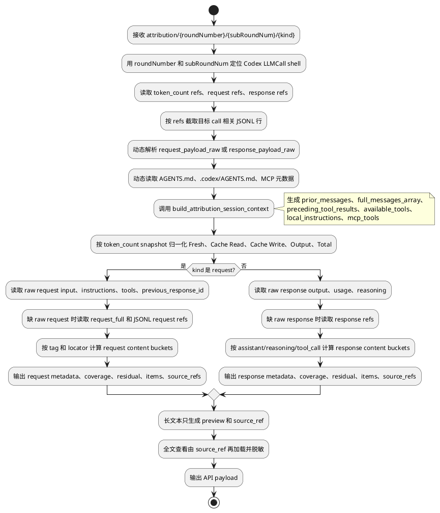

# Codex Token Attribution 规约

## 适用范围和判定入口

| 项 | 规约 |
|---|---|
| Runtime key | `codex` |
| API family | `openai_responses`，兼容 OpenAI Chat usage shape |
| Provider | `openai` |
| 主数据源 | Codex rollout JSONL。 |
| LLM call 判定 | 有效 `event_msg.token_count` 表示一次 LLM call 完成。 |
| 展示材料 | `response_item.message(role="assistant")` 是 canonical response；`event_msg.agent_message` 只是展示镜像或 fallback。 |
| Raw body | 有 `request_payload_raw` / `response_payload_raw` 时优先解析；否则按 rollout 可见事件重建。 |
| 去重 | `total_token_usage` 累计快照无增长时判为 `duplicate_token_count`，不建 call、不计 token。 |

## Scan 阶段标准流程

### Scan 启动提取顺序

| 顺序 | 信息 | 来源路径 | 处理 |
|---|---|---|---|
| 1 | session 文件 | `SessionSummary.file_path` | 定位 rollout JSONL；所有 `record_index` 以该文件行序为准。 |
| 2 | 项目目录 | `SessionSummary.project_key`、`SessionSummary.cwd`、`session_meta.payload.cwd` | 作为读取 `AGENTS.md`、`.codex/AGENTS.md`、MCP 配置的根。 |
| 3 | 平台默认提示词 | `session_meta.payload.base_instructions.text` | scan 只保存 locator；on-demand 再按段落/tag 分类为平台默认、能力说明、交互规则等。 |
| 4 | 会话注入提示词 | `response_item.payload.type="message"` 且 `role in ["developer","system"]` | 记录 role、content、record_index；首个 user message 前的指令可作为全局 refs。 |
| 5 | 工具定义 | `session_meta.payload.dynamic_tools`；fallback `agents/codex.py::_CODEX_BUILTIN_TOOL_SCHEMAS` | dynamic tools 是优先证据；缺失时使用 Codex builtin catalog。 |
| 6 | 本地项目指令 | `{project_dir}/AGENTS.md`、`{project_dir}/.codex/AGENTS.md`、`{project_dir}/CLAUDE.md`、`{project_dir}/.claude/CLAUDE.md` | 保存 locator；on-demand 读取和估算。 |
| 7 | MCP 元数据 | `{project_dir}/.mcp.json` 的 `mcpServers` / `mcp_servers` | 只保留 server/tool 名称。 |
| 8 | raw payload | `LLMCall.request_payload_raw`、`LLMCall.response_payload_raw` | scan 只记录是否存在和字节数；解析延迟到 on-demand。 |
| 9 | usage 累计基线 | `event_msg.payload.info.total_token_usage` | 用于判断 token_count 是否重复和计算 delta locator。 |

### `token_count` 边界规则

| 场景 | 处理 |
|---|---|
| call 来源 | `event_msg.payload.type == "token_count"`。Codex 不使用 `active_message_id`。 |
| 创建 | `total_token_usage` 相对上一有效累计快照有增长时，创建一个新的 `LLMCall shell`。 |
| 去重 | 累计快照无增长时写 `duplicate_token_count`，不创建 call，不贡献 token。 |
| request 绑定 | token_count 前缓存的 user/developer/system refs 和已返回工具结果 refs 绑定到该 call。 |
| response 绑定 | 上一个有效 token_count 之后出现的 assistant/reasoning/tool_call refs 绑定到该 call。 |
| usage 绑定 | 优先 `last_token_usage`；缺失时用 `total_token_usage` delta；scan 只保存 snapshot 和 delta locator。 |

### Scan 输出

| 输出 | 内容 |
|---|---|
| `LLMCall shell` | call id、有效 token_count record、时间、model、usage snapshot refs。 |
| `request refs` | user input、developer/system messages、tool output、global instruction/config locator。 |
| `response refs` | assistant message、reasoning、function_call、custom_tool_call locator。 |
| `diagnostics` | duplicate token_count、usage reset、未消费 refs、raw body 缺失。 |

Scan 不计算 bucket token、share、coverage、residual。

## On-demand Attribution 阶段标准流程

### On-demand 动态提取表

| 信息 | 动态读取来源路径 | 方法简述 | 截断/去重 |
|---|---|---|---|
| 目标 call | 有效 `event_msg.token_count` 生成的 `LLMCall.id`、`roundNumber/subRoundNum` | 只定位一个 token_count segment。 | 不为其它 token_count 计算 bucket。 |
| usage | `event_msg.payload.info.last_token_usage`；fallback `total_token_usage` delta；raw response `usage` | 优先 per-call usage；缺失才用累计 delta。 | 重复累计快照贡献 0。 |
| 平台默认提示词 | `session_meta.payload.base_instructions.text`；raw request `instructions` / system input | 作为 `platform_default_instructions`。 | 与 developer/system message 去重。 |
| 会话注入指令 | `response_item.payload.role in ["developer","system"]` 的 `content` | 按 `<skills_instructions>`、`<plugins_instructions>`、`<app-context>`、`<collaboration_mode>`、`<environment_context>` 等 tag 分类。 | tag 只作分类证据；占位符 tag 不单独成 bucket。 |
| 当前用户输入 | raw request `input[]` 最后一个 user item；fallback `event_msg.payload.type="user_message"` 的 `message` | raw request 优先；否则用 scan refs。 | 与 `request_full` 相同文本去重。 |
| 用户附件 | `event_msg.payload.images/local_images/text_elements`；raw request 多模态 input | 图片/file/text element 只在存在内容时产出。 | 空数组不产出。 |
| 对话历史 | raw request `input[]` 中当前 user 前的 items；fallback `session_context.prior_messages` | 按 role 和 item type 还原历史。 | `content_preview` 200 字符；token 可按全文估算。 |
| 工具结果 | `response_item.payload.type in ["function_call_output","custom_tool_call_output"]`、`output`；fallback `request_full` | 绑定到下一次有效 token_count。 | 同一 `call_id` 只计一次。 |
| 工具定义 | raw request `tools`；fallback `session_meta.payload.dynamic_tools`；再 fallback `_CODEX_BUILTIN_TOOL_SCHEMAS` | 估算每个 tool schema token；observed extras 补充。 | 同名/alias tool 归一。 |
| MCP 元数据 | `.mcp.json` 或 dynamic tools 中 MCP server/tool 信息 | 只提取名称、server、描述级信息。 | 不读取密钥和 command env。 |
| 项目指令文件 | `AGENTS.md`、`.codex/AGENTS.md`、`CLAUDE.md`、`.claude/CLAUDE.md` | on-demand 读取 locator。 | context 默认 2048 字符预览。 |
| provider state | raw request `previous_response_id` | 进入 metadata；提示可能有服务端上下文残差。 | 不进入 content bucket。 |
| assistant text | raw response output_text；fallback `response_item.message(role=assistant)`；再 fallback `event_msg.agent_message` | `response_item.message` 是 canonical。 | `agent_message` 只作 mirror/fallback，防重复。 |
| reasoning | raw response `reasoning` / `output_tokens_details.reasoning_tokens`；fallback `response_item.reasoning` | encrypted content 不展示原文，只保留引用。 | hidden reasoning 和 assistant text 不重复。 |
| tool call | `response_item.function_call/custom_tool_call` 的 `name/call_id/arguments` | 参数 JSON 进入 response `tool_call`。 | 同一 `call_id` 只计一次。 |
| non attribution | `task_started/task_complete/thread_goal_updated/patch_apply_end` | 进入 metadata 或 diagnostics。 | 不参与 coverage。 |

## Token 字段映射

| 字段 | 原始 session JSONL/本地绑定路径 | 标准取值 | 缺失/冲突处理 |
|---|---|---|---|
| LLM call key | `event_msg.payload.type == "token_count"` 的 record index/timestamp。 | 每个有效 `token_count` 生成一个 call id。 | 重复累计快照不生成 call，只写 diagnostics。 |
| Provider request input | `event_msg.payload.info.last_token_usage.input_tokens`；无 per-call 时用 `total_token_usage.input_tokens` delta；兼容 `prompt_tokens`。 | provider 上报的输入总量。 | 只作摘要和 Fresh 计算输入，不直接作为 UI Fresh。 |
| `Cache Read` | `last_token_usage.cached_input_tokens`、`input_tokens_details.cached_tokens`；无 per-call 时用累计 delta。 | `min(cache, provider request input)`。 | 字段缺失为 `unavailable`；聚合显示可用 0，但 precision 必须保留。 |
| `Fresh` | Provider request input 与 `Cache Read`。 | `max(provider request input - Cache Read, 0)`。 | 无 input 时为 0/`unavailable`；不得用 raw total 反推。 |
| `Cache Write` | OpenAI/Codex Responses 无稳定 cache creation 字段。 | `0`。 | precision=`unavailable` 或 `not_reported`；不得推断。 |
| `Output` | `last_token_usage.output_tokens`、`completion_tokens`；无 per-call 时用累计 delta。 | provider 可见输出 token。 | hidden reasoning 不并入 `Output` 文本 bucket。 |
| Hidden reasoning | `reasoning_output_tokens`、`reasoning_tokens`、`output_tokens_details.reasoning_tokens`。 | response 侧 `hidden_reasoning` bucket。 | 字段缺失则不展示该 bucket。 |
| `Total` | 归一化组件。 | `Fresh + Cache Read + Cache Write + Output`。 | `total_tokens` 只作诊断或 total-only fallback。 |

## Codex 原始绑定路径

| 数据 | 原始绑定路径 | 用途 |
|---|---|---|
| session 元信息 | `session_meta.payload.id/cwd/model_provider/base_instructions/dynamic_tools/git` | session 摘要、基础提示、工具定义 fallback。 |
| 用户输入 | `event_msg.payload.type == "user_message"` | `current_user_input`、`user_attachments`。 |
| developer/system 输入 | `response_item.payload.type == "message"` 且 `role in ["developer","system"]` | 平台、权限、skill/plugin、app、collaboration、environment 等 request bucket。 |
| token usage | `event_msg.payload.type == "token_count"`，读取 `payload.info.last_token_usage` 与 `payload.info.total_token_usage` | LLM call 边界、五字段、重复快照诊断。 |
| 助手文本 | `response_item.payload.type == "message"` 且 `role == "assistant"` | response `assistant_text` canonical source。 |
| 助手镜像 | `event_msg.payload.type == "agent_message"` | assistant 文本 fallback、phase metadata。 |
| reasoning | `response_item.payload.type == "reasoning"` | response `hidden_reasoning` 和 `reasoning_reference` metadata。 |
| 工具调用 | `response_item.payload.type in ["function_call","custom_tool_call"]` | response `tool_call`。 |
| 工具结果 | `response_item.payload.type in ["function_call_output","custom_tool_call_output"]` | 下一次 LLM call 的 `tool_result_context`。 |

## Request content bucket 提取规则

| 全局候选值 | Codex 提取规则 |
|---|---|
| 当前用户输入 | 从 raw request 最后一个 user input 提取；raw 缺失时用当前 call 前最近的 `event_msg.user_message.message`。 |
| 用户附件/多模态输入 | 从 `event_msg.user_message.images/local_images/text_elements` 提取；空数组不产出。 |
| 对话消息上下文 | 从 raw request input 历史 items 提取；raw 缺失时按当前 call 前的 user/assistant/function_call 序列重建。 |
| 工具结果上下文 | 从当前 call 前的 `function_call_output` / `custom_tool_call_output` 提取；归属到下一次 LLM call。 |
| 仓库/文件上下文 | 从 raw request、tool result、`request_full` 中的文件、diff、搜索结果、目录信息提取。 |
| 工具定义 | 优先 raw request `tools`；缺失时用 `session_meta.payload.dynamic_tools`、Codex builtin tool catalog 和 observed extras。 |
| MCP 工具元数据 | Codex raw request 或 dynamic tools 中存在 MCP server/tool metadata 时提取；没有则不产出。 |
| Skill/Plugin 能力目录 | 从 `<skills_instructions>`、`<plugins_instructions>` 或可见 skill/plugin 列表提取。 |
| 平台默认指令 | 从 `session_meta.payload.base_instructions.text` 中平台默认身份、安全和基础行为段提取。 |
| 会话注入指令 | 从 `response_item.message(role=developer/system)` 中不属于其它专门分类的本次 session 规则提取。 |
| 项目指令文件 | 从 `<INSTRUCTIONS>`、AGENTS/CLAUDE/Qoder 规则正文提取。 |
| Custom Agent 角色提示 | Codex 可见 custom agent/subagent prompt 片段才产出；默认不从隐藏 runtime 推断。 |
| 隐藏指令估算 | 只有可验证 hidden prompt 残差且没有原始绑定路径时产出；不可见时只写 diagnostics。 |
| 权限/沙箱策略 | 从 `<permissions instructions>`、`permission_profile`、sandbox/approval/network 说明提取。 |
| 客户端应用上下文 | 从 `<app-context>` 提取。 |
| 协作模式规则 | 从 `<collaboration_mode>` 提取。 |
| 运行环境上下文 | 从 `<environment_context>` 及 `cwd/shell/current_date/timezone/filesystem/workspace_roots/root` 提取。 |
| 任务目标/续跑上下文 | 从 `<codex_internal_context>`、`<objective>`、active goal continuation 提取。 |
| 未定位 | `Fresh - sum(known request content buckets)`，小于 0 时归零并写 diagnostics。 |

## Request metadata 提取规则

| metadata key | Codex 提取规则 |
|---|---|
| `model_config` | `session_meta.payload.model_provider`、turn context `model/effort`、raw request config。 |
| `context_management` | Codex compact/handoff/continuation 元信息；没有则不产出。 |
| `cache_control` | Codex/OpenAI 明确 cache-control 字段存在时提取；通常不可用。 |
| `request_identity` | `session_meta.payload.id/timestamp/source/thread_source`。 |
| `provider_state` | raw request `previous_response_id`；不做内容 bucket。 |
| `usage_metadata` | `model_context_window`、`rate_limits`、raw `total_tokens` 冲突信息。 |
| `non_attribution_events` | `task_started`、`task_complete`、`thread_goal_updated`、`patch_apply_end`。 |

## Response content bucket 提取规则

| 全局候选值 | Codex 提取规则 |
|---|---|
| 助手文本 | 优先 `response_item.message.content[type=output_text]`；缺失时用 `event_msg.agent_message.message` fallback。 |
| 可见 thinking 文本 | Codex rollout 默认不产出；只有可见 thinking block 时产出。 |
| 工具调用结构 | 从 `response_item.function_call` / `custom_tool_call` 提取工具名、call id、参数 JSON；单个调用放 `items[]`。 |
| 隐藏推理输出 | 从 usage reasoning 字段和 `response_item.reasoning.encrypted_content` 建立绑定；不展示 encrypted 原文。 |
| 结构化响应块 | 从 assistant 最终文本中的 `<oai-mem-citation>` 等结构化块提取；可见 token 参与分布。 |
| 未定位输出 | `Output - sum(known response content buckets)`，小于 0 时归零并写 diagnostics。 |

## Response metadata 提取规则

| metadata key | Codex 提取规则 |
|---|---|
| `response_status` | `phase`、`status`、message role、tool call status。 |
| `reasoning_reference` | `response_item.reasoning.summary`、`encrypted_content`、reasoning token 字段。 |
| `provider_tool_use_metadata` | OpenAI/Codex provider server tool use 字段存在时提取；没有则不产出。 |
| `citation_metadata` | `<oai-mem-citation>`、`<citation_entries>`、`<rollout_ids>` 解析状态。 |

## 常见问题及处理

| 问题 | 判定 | 处理 |
|---|---|---|
| R1 token 异常偏大 | 多个后续 `token_count` 被挂到第一个可见 assistant 窗口。 | 只用有效 `event_msg.token_count` 建 LLM call；assistant 只挂 `response_refs`。 |
| 重复计费 | `total_token_usage` 各组件相对上一累计快照全为 0。 | 记录 `duplicate_token_count`、`contribution=0`，不建 call。 |
| Fresh 与 Total 重复 | 直接把 `input_tokens` 当 Fresh，又把 `cached_input_tokens` 加入 Total。 | `Fresh = input_tokens - cached_input_tokens`。 |
| config 被计入 bucket | `reasoning/max_tokens/model/store/include` 出现在分布里。 | 全部移入 metadata；只让 residual 承担不可解释差值。 |
| `agent_message` 与 `response_item.message` 重复展示 | 两者文本相同或引用同一输出。 | 以 `response_item.message` 为 canonical；`agent_message` 只作 mirror/fallback。 |
| 工具定义缺失 | raw request 没有 `tools`。 | 使用 Codex builtin catalog，再合并本 session 观测到的额外工具。 |
