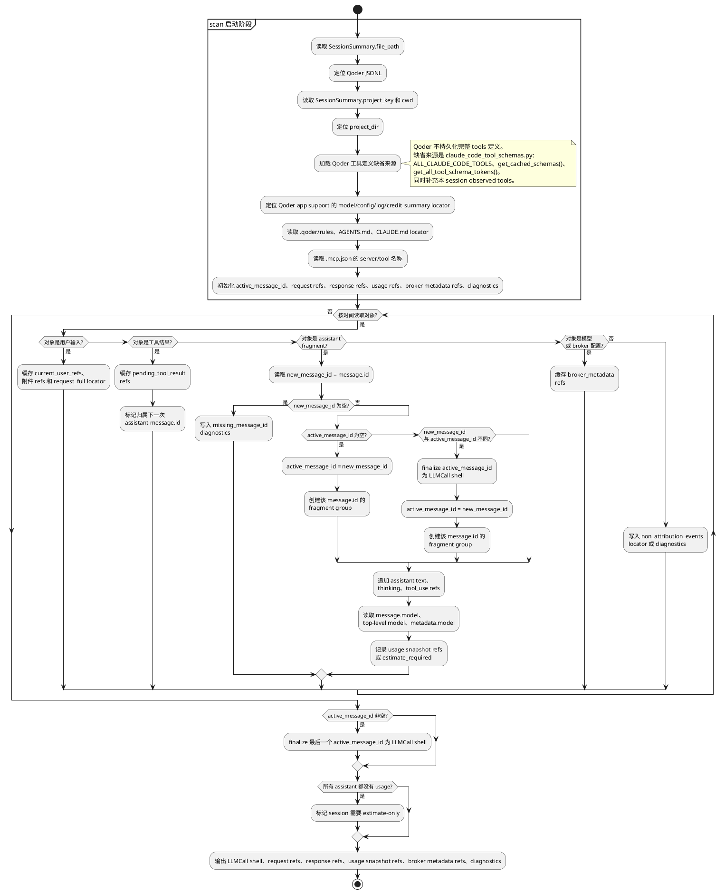
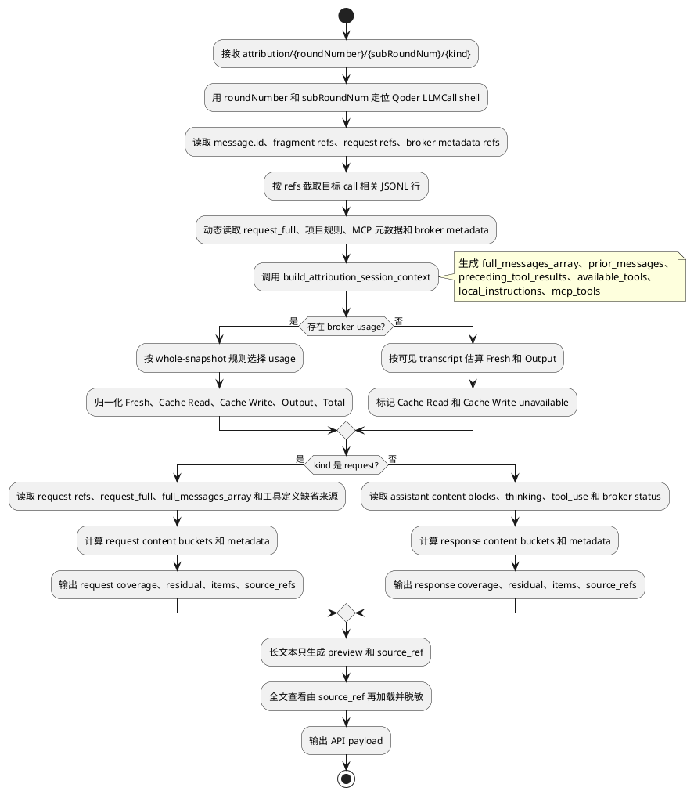

# Qoder Token Attribution 规约

## 适用范围和判定入口

| 项 | 规约 |
|---|---|
| Runtime key | `qoder` |
| API family | `qoder_broker`；无 usage 时为 `estimate_only` |
| Provider/Broker | `qoder`；不得伪装成 Anthropic/OpenAI。 |
| Billing units | token 字段使用 `tokens`；credits 只进入 `credit_summary`。 |
| 主数据源 | Qoder JSONL；可补充 Qoder app support 的 model/config/log 信息。 |
| LLM call 判定 | assistant `message.id`；同 id fragments 合并为一个 LLM call。 |
| Raw body | 默认不可得；request/response attribution 基于 transcript、normalized usage 和本地可见 context 重建。 |

## Scan 阶段标准流程

### Scan 启动提取顺序

| 顺序 | 信息 | 来源路径 | 处理 |
|---|---|---|---|
| 1 | session 文件 | `SessionSummary.file_path` | 定位 Qoder JSONL；所有 `record_index` 以该文件行序为准。 |
| 2 | 项目目录 | `SessionSummary.project_key`、`SessionSummary.cwd`、JSONL top-level project/workspace 字段 | 作为读取 Qoder rules、本地指令、MCP 配置的根。 |
| 3 | 工具定义缺省来源 | `src/session_browser/attribution/agents/claude_code_tool_schemas.py` 的 `ALL_CLAUDE_CODE_TOOLS/get_cached_schemas/get_all_tool_schema_tokens` | Qoder 无完整 tools 定义时使用 Claude-Code-like 默认工具定义，并补充 observed tools。 |
| 4 | observed tools | assistant `message.content[type=tool_use].name`、`tool_calls_raw`、context `available_tools` | 只作为补充，不代表完整可用工具列表。 |
| 5 | broker/system locator | Qoder JSONL 或 app support 中可见 `system/tools/messages/request_full` | scan 只保存 locator；不可见 broker state 不伪造。 |
| 6 | model/config | assistant `message.model`、event top-level `model`、`metadata.model`、app support config/log | 按优先级绑定到 call metadata locator。 |
| 7 | credit summary | Qoder billing/credit log 或 app support credit summary | 只进入 `credit_summary` / `usage_metadata`，不反推 token。 |
| 8 | 项目指令 | `{project_dir}/.qoder/rules`、`AGENTS.md`、`.codex/AGENTS.md`、`CLAUDE.md` | 保存 locator；on-demand 再读取和估算。 |
| 9 | MCP 元数据 | `{project_dir}/.mcp.json` 的 `mcpServers` / `mcp_servers` | 只保留 server/tool 名称。 |
| 10 | usage 缺失标记 | assistant fragments 中没有 `message.usage.input_tokens` | 标记 `estimate_required`；不在 scan 阶段估算最终 bucket。 |

### `active_message_id` 规则

| 场景 | 处理 |
|---|---|
| 初始值 | 为空。 |
| 来源 | 当前 assistant fragment 的 `message.id`。 |
| 创建 | 第一次读到非空 `message.id` 时创建 fragment group。 |
| 追加 | 相同 `message.id` 的后续 fragment 追加到同一 LLM call。 |
| 切换 | 不同非空 `message.id` 出现时，先 finalize 旧 group，再开启新 group。 |
| 收尾 | 文件结束时 finalize 最后一个非空 group。 |
| 缺失 | 写 `missing_message_id` diagnostics；只有可由 broker request locator 明确绑定时才用顺序缺省绑定。 |

### Scan 输出

| 输出 | 内容 |
|---|---|
| `LLMCall shell` | call id、`message.id`、时间、model、broker、usage snapshot refs。 |
| `request refs` | user prompt、tool_result、request_full、system/tools/messages locator。 |
| `response refs` | assistant `text/thinking/tool_use` locator。 |
| `broker metadata refs` | model/config/log/credit_summary、runtime、workspace、git locator。 |
| `diagnostics` | 缺 id、无 usage、cache write 推断、broker raw total 冲突。 |

Scan 不计算 bucket token、share、coverage、residual；credits 不参与 token 计算。

## On-demand Attribution 阶段标准流程

### On-demand 动态提取表

| 信息 | 动态读取来源路径 | 方法简述 | 截断/去重 |
|---|---|---|---|
| 目标 call | scan 输出的 `LLMCall.id == message.id`、`roundNumber/subRoundNum` | 只定位一个 assistant message group。 | 不为其它 message.id 计算 bucket。 |
| usage | assistant `message.usage`；缺省来源 estimate-only | 有 usage 时按 whole-snapshot 规则；无 usage 时用可见 transcript 估算 Fresh/Output。 | cache read/write 缺失标记 unavailable。 |
| 当前用户输入 | user `message.content[type=text]`；`request_full` 当前用户段 | 优先显式 user prompt；缺失用 request_full。 | 与 request_full 相同片段去重。 |
| 对话历史 | `build_attribution_session_context.full_messages_array`、`prior_messages`、显式 `history_messages` | 按 call 边界取当前 call 前历史。 | `content_preview` 200 字符；token 按全文或可读切片估算。 |
| 工具结果 | user `message.content[type=tool_result]`、`request_full` 中 `Tool result for ...` | 只取当前 call 前已返回的工具结果。 | 同一 `tool_use_id` 只计一次。 |
| 仓库/文件上下文 | `request_full`、工具结果、文件片段、diff、搜索结果 | 从文本结构和工具名识别文件上下文。 | preview 截断；全文由 source_ref 加载。 |
| 工具定义 | Qoder 可见 tools；缺省来源 `ALL_CLAUDE_CODE_TOOLS` + observed tools | 默认工具定义作为基线，observed Qoder-only tools 用保守估算。 | 同名 tool 只计一次；unknown tool 使用固定估算。 |
| MCP 元数据 | `.mcp.json` server/tool 名称 | 只输出 server 和 tool 名。 | 不读取密钥和 command env。 |
| Skill/Plugin 能力目录 | Qoder 可见 capability/agent list、system/tool messages | 仅可见时产出。 | 不从隐藏 broker state 推断。 |
| 平台默认指令 | broker/system locator、可见 system messages | 可见才归入 `platform_default_instructions`。 | 不可见只写 diagnostics/residual。 |
| 会话注入指令 | Qoder 可见 system/developer 段、runtime 注入段 | 按来源分类。 | 与项目规则去重。 |
| 项目指令文件 | `.qoder/rules`、`AGENTS.md`、`.codex/AGENTS.md`、`CLAUDE.md` | on-demand 读取 locator。 | 只展示预览；全文需脱敏。 |
| model/config metadata | `message.model`、top-level `model`、`metadata.model`、app support config | 按优先级取 model；其它 config 进入 metadata。 | 不参与 content coverage。 |
| credit summary | Qoder billing/credit log、app support credit summary | 只进入 `usage_metadata` 或 `credit_summary`。 | 不反推 token。 |
| assistant text | assistant `message.content[type=text].text`、`response_full` | 作为 response `assistant_text`。 | 与 thinking/tool_use 分离。 |
| assistant thinking | assistant `message.content[type=thinking].thinking` | 字段类型明确才归入 thinking。 | 不并入 assistant text。 |
| tool call | assistant `message.content[type=tool_use].name/input/id`、`tool_calls_raw` | 参数 JSON 进入 response `tool_call`。 | 同一 tool id 只计一次。 |

## Token 字段映射

| 字段 | 原始 session JSONL/本地绑定路径 | 标准取值 | 缺失/冲突处理 |
|---|---|---|---|
| LLM call key | assistant record 的 `message.id`。 | 同 id fragments 合并为一个 call。 | 无 id 时用事件顺序缺省绑定，并写 diagnostics。 |
| Provider request input | `message.usage.input_tokens` / `prompt_tokens`，或 Qoder usage snapshot 同义字段。 | Qoder broker 上报的 request input 总量；可能包含 cache read。 | 无 usage 时用可见上下文估算。 |
| `Fresh` | Provider request input 与 `Cache Read`。 | 若 broker input 包含 cache read，则 `max(provider request input - Cache Read, 0)`；若存在明确 fresh 字段则用 fresh 字段。 | 不得直接把 inclusive `input_tokens` 当 Fresh；无 usage 时为估算值。 |
| `Cache Read` | `cache_read_input_tokens`、`cache_read_tokens`、`cached_tokens`。 | provider/broker 原值。 | 0 是有效值；字段缺失才 `unavailable`。 |
| `Cache Write` | `cache_creation_input_tokens`、`cache_write_input_tokens`、`cache_write_tokens`。 | provider/broker 原值。 | 不得用下一次 cache read delta 覆盖；推断值只能进 diagnostics。 |
| `Output` | `output_tokens`、`completion_tokens`，必要时合并非重复 thinking/reasoning。 | provider/broker 可见输出。 | 无 usage 时按 assistant 文本估算。 |
| `Total` | 归一化组件。 | `Fresh + Cache Read + Cache Write + Output`。 | broker raw total 只作诊断或缺省处理。 |
| Credits | Qoder credit 数据或本地 billing log。 | 单独 `credit_summary`。 | 不反推 token。 |

## Usage fragment 合并

| 项 | 规约 |
|---|---|
| 分组 | 同一 assistant `message.id` 的 fragments 属于一个 LLM call。 |
| Request input snapshot | 取同组最大非零 provider request input snapshot，再按 cache read 归一化为 Fresh。 |
| Accounting snapshot | `Cache Read`、`Cache Write`、`Output` 必须来自同一个 snapshot。 |
| Snapshot 优先级 | `Output > 0` > cache 字段存在 > 组件合计更大 > JSONL 中更晚。 |
| Cache write inferred | 可记录 `qoder_cache_write_inferred_tokens` 诊断；不得写回 `Cache Write`。 |
| 无 usage | 只估算 Fresh/Output；Cache Read/Write 为 0 且 precision=`unavailable`。 |

## Request content bucket 提取规则

| 全局候选值 | Qoder 提取规则 |
|---|---|
| 当前用户输入 | 从当前 user prompt 或 `request_full` 当前用户段提取。 |
| 用户附件/多模态输入 | Qoder 日志存在图片、文件、text element 时提取；没有则不产出。 |
| 对话消息上下文 | 优先用 call-scoped `full_messages_array`；缺失时用 explicit `history_messages`。 |
| 工具结果上下文 | 从当前 call 前的 tool result 或 `request_full` 中 tool result 片段提取。 |
| 仓库/文件上下文 | 从 `request_full`、工具结果、文件片段、diff、搜索结果提取。 |
| 工具定义 | 优先 Qoder 可见 tools；缺失时用 Claude-Code-like 默认工具定义并补充 Qoder-only observed tools。 |
| MCP 工具元数据 | Qoder 日志存在 MCP tools/servers 信息时提取；没有则不产出。 |
| Skill/Plugin 能力目录 | Qoder 可见 skill/plugin/agent capability 列表时提取；没有则不产出。 |
| 平台默认指令 | Qoder broker 可见默认身份、安全和基础行为提示时提取；不可见时不编造。 |
| 会话注入指令 | 从 Qoder 可见 system/developer 指令或 broker request 系统段中提取本次 session 规则。 |
| 项目指令文件 | 从 Qoder rules、本地配置、transcript system reminder 提取。 |
| Custom Agent 角色提示 | Qoder 可见 agent/subagent prompt 才产出；默认不从隐藏 broker state 推断。 |
| 隐藏指令估算 | 只有可验证 hidden prompt 残差且没有原始绑定路径时产出；不可见时只写 diagnostics。 |
| 权限/沙箱策略 | Qoder 日志明确权限、sandbox、approval 策略时提取；没有则不产出。 |
| 客户端应用上下文 | Qoder app/runtime 能力说明存在时提取；没有则不产出。 |
| 协作模式规则 | Qoder 明确注入协作模式规则时提取；没有则不产出。 |
| 运行环境上下文 | 从 cwd、project、shell、workspace、git branch、runtime version 等环境事实提取。 |
| 任务目标/续跑上下文 | 从 task/goal/continuation 上下文提取；没有则不产出。 |
| 未定位 | `Fresh - sum(known request content buckets)`，小于 0 时归零并写 diagnostics。 |

## Request metadata 提取规则

| metadata key | Qoder 提取规则 |
|---|---|
| `model_config` | model、output limit、thinking/reasoning、broker config。 |
| `context_management` | Qoder 上下文压缩/清理/保留策略存在时提取。 |
| `cache_control` | broker 明确 cache-control 字段存在时提取。 |
| `request_identity` | session id、project id、account/device 信息。 |
| `provider_state` | broker request 明确出现 provider state 引用时提取。 |
| `usage_metadata` | credits、broker raw total、cache write inferred、rate/context window。 |
| `non_attribution_events` | 标题、进度、状态同步、快照类事件。 |

## Response content bucket 提取规则

| 全局候选值 | Qoder 提取规则 |
|---|---|
| 助手文本 | 从 assistant text 或 `response_full` 提取。 |
| 可见 thinking 文本 | Qoder 日志可见 thinking/reasoning 文本且未并入助手文本时产出。 |
| 工具调用结构 | 从 `content_blocks[type=tool_use]` 或 `tool_calls_raw` 提取工具名和参数 JSON；单个调用放 `items[]`。 |
| 隐藏推理输出 | 只有 provider/broker 明确上报且未并入可见输出的 thinking/reasoning token 时产出。 |
| 结构化响应块 | 可见结构化正文块存在时产出。 |
| 未定位输出 | `Output - sum(known response content buckets)`，小于 0 时归零并写 diagnostics。 |

## Response metadata 提取规则

| metadata key | Qoder 提取规则 |
|---|---|
| `response_status` | finish/progress/status、broker 可见结构字段。 |
| `reasoning_reference` | broker reasoning summary/encrypted reference 存在时提取。 |
| `provider_tool_use_metadata` | broker/server-side tool use 计数存在时提取。 |
| `citation_metadata` | 结构化引用 tag 存在时提取；没有则不产出。 |

## 常见问题及处理

| 问题 | 判定 | 处理 |
|---|---|---|
| provider 被误写成 Anthropic/OpenAI | Qoder 只有 broker usage，underlying provider 不可靠。 | provider 固定为 `qoder`，underlying provider 缺失就留空。 |
| Fresh 与 cache read 重复 | broker `input_tokens` 已包含 cache read，又被直接当成 Fresh。 | 先识别 inclusive input，再计算互斥 Fresh。 |
| cache write 被错误回填 | 用下一次 cache read 增量推断本次写入。 | 推断值只进 diagnostics，不写入 `Cache Write`。 |
| config 被计入 bucket | model/reasoning/output/cache config 出现在分布里。 | 移入 request metadata。 |
| 工具定义偏小 | 只用实际调用过的工具。 | 使用默认工具定义，再补充 Qoder-only observed tools。 |
| credits 与 tokens 混算 | 用 credit 推 token 或把 credit 加入 Total。 | credits 只进入 `usage_metadata` 或 `credit_summary`。 |
