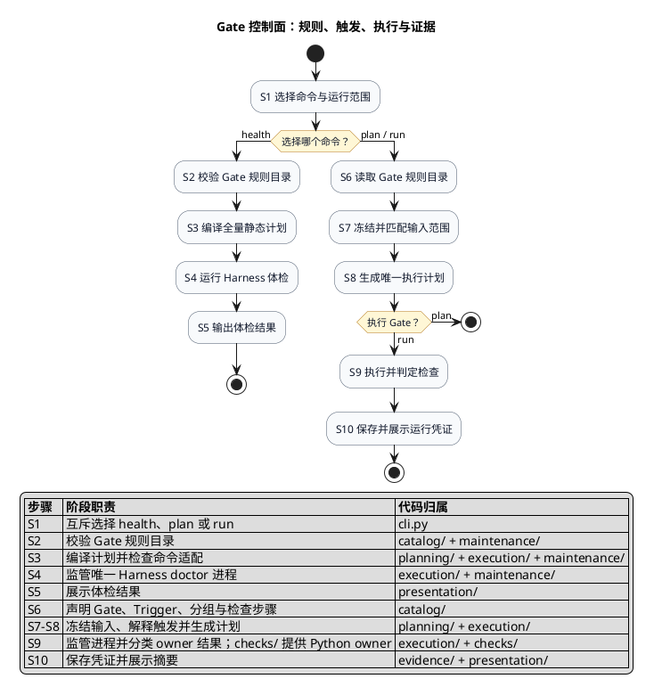

# Gate 控制面：架构与触发流程

本文回答四个问题：**本次检查哪些文件、哪些 Gate 会被选中、实际会启动什么命令、结果保存在哪里**。
唯一公开入口是 `scripts/gates/cli.py`，Gate 规则目录是唯一声明真源。

## 术语

下表先用业务含义解释术语；括号中的英文是代码类型或公开名称，用于后续查代码和读 JSON。

| 术语 | 含义 | 例子 |
|---|---|---|
| 运行范围（`incremental` / `full`） | 决定根据变更文件选 Gate，还是检查整个仓库 | 提交前通常用 `incremental`，人工全量检查用 `full` |
| Gate | 用户可见的一道逻辑质量门，负责回答一个质量问题 | `javaBuildVerification` 回答 Java build 是否完整通过 |
| 触发条件（`Trigger`） | 路径匹配规则，说明某个变更为什么需要某个 Gate | 修改 `java/web/**` 会选中 Web 相关 Gate |
| 人工分组（`TargetPreset`） | 方便人工一次选择一组 Gate；只表示分组，不表示执行强度或耗时 | `web-interface` |
| Gate 检查步骤（`RecipeStep`） | 一个 Gate 内由某类工具负责的一项检查动作 | 运行 Ruff、一个 Python Check、一组 Playwright 测试或 Gradle task |
| 系统命令（`CommandInvocation`） | 真正启动的一个 OS 进程；一个检查步骤可以产生多个系统命令 | scan smoke 会先构建 launcher，再执行 smoke 命令 |
| 执行计划（`GatePlan`） | 本次运行唯一的冻结清单，包含输入、选择原因、Gate、检查步骤和系统命令 | `plan --format json` 的主体 |
| 步骤结果（`StepResult`） | 一个 Gate 检查步骤的综合结果 | Python Check 完成后得到 PASS/BLOCKED/FAIL |
| Gate 结果（`GateResult`） | 一个 Gate 下全部步骤合并后的结果 | 任一步 FAIL，则该 Gate FAIL |
| 运行凭证（`RunReceipt`） | 一次 `run` 的不可覆盖证据，保存输入、命令、日志、结果和精确重跑命令 | `tmp/quality/runs/<run-id>/summary.json` |
| Python 规则（`Check`） | 仅指 `scripts/gates/checks/` 中的 Python 领域规则，是一种检查步骤 owner | `privacy.credential-leak` |
| `NOT_TRIGGERED` | Gate 没被选入本次计划的选择状态，不是执行结果 | 没有路径命中某个 Gate 的 Trigger |

## 命令入口

| 命令 | 回答的问题 | 是否执行 Gate owner | 是否写运行凭证 |
|---|---|---:|---:|
| `list` | 有哪些 Gate 和人工分组？ | 否 | 否 |
| `explain` | 一个 Gate/分组检查什么、何时触发？ | 否 | 否 |
| `plan` | 这次会选哪些 Gate、启动多少命令？ | 否 | 否 |
| `run` | 执行计划后结果是什么？ | 是 | 是 |
| `health` | 规则目录、计划编译、命令适配和 Harness 是否可用？ | 只执行一个 Harness doctor | 否 |

常用入口：

```bash
python3 scripts/gates/cli.py list
python3 scripts/gates/cli.py explain --gate javaBuildVerification
python3 scripts/gates/cli.py explain --target web-interface

python3 scripts/gates/cli.py plan --mode incremental
python3 scripts/gates/cli.py plan --mode incremental --base <commit>
python3 scripts/gates/cli.py plan --mode incremental --changed-files '["scripts/gates/cli.py"]'

python3 scripts/gates/cli.py run --mode incremental
python3 scripts/gates/cli.py run --mode full
python3 scripts/gates/cli.py run --mode full --gate javaBuildVerification
python3 scripts/gates/cli.py run --mode full --target agent-governance

python3 scripts/gates/cli.py health
python3 scripts/gates/cli.py health --format json
```

## 架构与触发流程

图中的步骤展示运行顺序，图内右侧表格同时说明**阶段职责和代码归属**。主流程分为 `plan` 与 `run`；
`health` 是快速体检旁路，不会执行完整 Gate，也不会读取或生成运行凭证。



### 图中步骤说明

- **S1**：操作者选择 `plan`、`run` 或 `health`，并明确 `incremental`/`full` 范围。
- **S2–S5**：`health` 校验全部声明和适配能力，只执行一个 Harness doctor，然后直接展示体检结果。
- **S6**：规则目录提供“有哪些 Gate、何时触发、每个 Gate 包含哪些检查步骤”。
- **S7**：计划阶段先冻结输入，再保存每条 `文件 → pattern → Gate` 的命中原因。
- **S8**：把选中的 Gate 展开为检查步骤，再把每个步骤适配为可执行的系统命令；到这里 `plan` 已完成。
- **S9**：只有 `run` 进入执行阶段；每个命令完成后按 Python Check、pytest、Playwright 或 Gradle 的证据规则判定。
- **S10**：合并步骤/Gate 状态，复制日志并保存运行凭证；终端只展示凭证摘要和重跑入口。

依赖只能沿图中主干向下：规则目录 → 计划 → 执行 → 证据/展示。`maintenance/` 只走图中的 health 旁路；
禁止用跨目录 `support.py`、`utils.py` 或同名 helper 绕过边界。

## 输入与触发规则

### 输入从哪里来

| 调用方式 | 冻结的输入 |
|---|---|
| `--mode incremental` | 当前 Git staged、working、untracked 文件 |
| `--mode incremental --base <commit>` | `<commit>...HEAD` 的 changed files |
| `--mode incremental --changed-files '[...]'` | 调用者给出的仓库相对路径 |
| `--mode full` | 全部 Gate；记录 HEAD，不携带 changed-files 列表 |

`--base` 与 `--changed-files` 互斥。`plan` 输出中的 `snapshot.source`、`snapshot.files` 和
`contentFingerprint` 共同证明计划使用了哪一份输入。

### Gate 怎么被选中

1. `full` 且没有 selector：选择全部 Gate。
2. 指定 `--gate`：只选择该 Gate；指定 `--target`：按规则目录展开该人工分组。
3. 普通 `incremental`：`always` Gate 固定选中，其他 Gate 根据 changed file 与 Trigger pattern 匹配。
4. 每条命中保存为 `file → pattern → Gate`；未选中的 Gate 记录具体原因，例如
   `no-trigger-pattern-matched` 或 `excluded-by-selector`。
5. `incremental` selector 需要非空输入；没有变更但需要人工执行时使用 `full --gate/--target`。

## 状态、进度与证据

| 状态 | 含义 |
|---|---|
| `PASS` | required 检查完整执行且全部通过 |
| `BLOCKED` | 检查完整执行并发现源码、规则或测试问题，通常是 `reason=verification-failed` |
| `FAIL` | 输入、依赖、运行时、停滞、中断或结果不可判定，导致检查未能有效完成 |

合并规则：任一 Gate 为 FAIL，则整次运行 FAIL；否则任一 Gate 为 BLOCKED，则整次运行 BLOCKED；全部
`StepResult` 和 `GateResult` 为 PASS，整次运行才是 PASS。`NOT_TRIGGERED` 只说明没有执行，不参与状态合并。

运行期间 stderr 事件固定为 `PLAN / START / HEARTBEAT / STALL / RESULT / DONE`。长步骤每 30 秒输出 heartbeat；
日志 120 秒没有增长时报告 STALL，并记录不可清除的停滞事实。即使后续日志恢复、进程以 0 退出或 owner
报告 PASS，该命令仍归为 `FAIL reason=process-stalled`，并向步骤、Gate、整次运行及凭证传播；CLI 返回 2。
显式中断、信号终止或启动失败保留其更具体的运行失败原因。STALL 不自动终止进程，也不自动重试；显式中断
会清理受管进程组。HEARTBEAT 只表示仍在等待，本身不改变执行状态。

`run` 将输入快照、触发原因、HEAD/base、内容指纹、系统命令、类型化结果、日志和 canonical rerun 保存到新的
`tmp/quality/runs/<run-id>/`。run-id 目录不可覆盖，`latest.json` 只用于导航。

## 代码导航：排查某一步时看哪里

这些函数不是命令参数，而是上图各步骤的实现入口：

| 排查场景 | 实现入口 | 接收什么 | 产出什么 |
|---|---|---|---|
| S7 的输入文件不符合预期 | `capture_change_snapshot` | repo、mode、可选 base/changed-files | 冻结的 `ChangeSnapshot` |
| S7 某个 Gate 触发原因不对 | `match_trigger` | changed files、规则目录中的 Gate | `TriggerMatch` 因果记录 |
| S8 选中的 Gate 或进程数不对 | `compile_gate_plan` | 输入快照、mode、selector、命令适配器 | 唯一 `GatePlan` |
| S8 某个检查步骤生成了错误命令 | `adapt_recipe_step` | Gate、检查步骤、mode、changed files | 一个或多个 `CommandInvocation` |
| S9 进程启动、heartbeat 或清理异常 | `supervise_process` | 一个系统命令、工作目录、日志路径 | `ProcessObservation` |
| S9 PASS/BLOCKED/FAIL 分类异常 | `classify_owner_outcome` | 系统命令及进程观察结果 | `InvocationResult` |
| S9 Gate 内步骤合并异常 | `orchestrate_gate_run` | 冻结执行计划 | `StepResult` 与 `GateResult` |
| S10 凭证、日志或重跑命令异常 | `store_run_receipt` | 执行计划与 Gate 结果 | schema v5 `RunReceipt` |
| S2–S5 health 结果异常 | `audit_gate_health` | 当前 repo 与事件输出入口 | `GateHealthAudit` |
