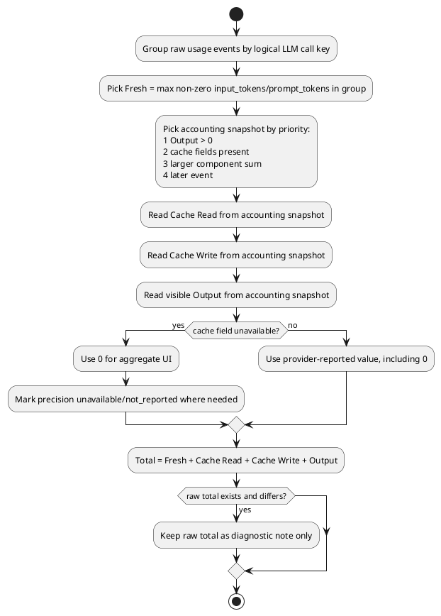

# Token Usage Extraction Standard

## 已发现问题

1. `Fresh` 曾被当作 `input_tokens - cache_read - cache_write`，导致高缓存命中时被压小。
2. 同一逻辑 LLM call 的多段 usage 曾直接取最后一段或逐字段取最大值，导致 `Fresh=6` 这类片段值覆盖真实 request input。
3. Codex/OpenAI raw `total_tokens` 曾覆盖组件合计，导致 tokenbar 四段合计与 Total 不一致。

## 五字段标准

| 字段 | 标准含义 | 标准公式 |
|---|---|---|
| `Fresh` | 本次请求实际新增/发送的输入规模 | provider `input_tokens` / `prompt_tokens` |
| `Cache Read` | provider 报告的缓存读取输入 token | provider cache read 字段 |
| `Cache Write` | provider 报告的缓存写入输入 token | provider cache creation/write 字段；未报告为 `0` 或 unavailable |
| `Output` | provider 报告的可见输出 token | provider output/completion 字段；隐藏 reasoning 不并入 |
| `Total` | UI 展示总量 | `Fresh + Cache Read + Cache Write + Output` |

`Fresh` 不从 `Cache Read` 或 `Cache Write` 扣减。provider raw `total_tokens` 只作诊断；只在完全没有组件字段时作为 fallback。

## Provider 字段映射

| Agent/API | Fresh | Cache Read | Cache Write | Output |
|---|---|---|---|---|
| Claude Code / Anthropic-like | `input_tokens` | `cache_read_input_tokens` | `cache_creation_input_tokens` | `output_tokens` |
| Codex / OpenAI Responses | `input_tokens` | `cached_input_tokens` 或 `input_tokens_details.cached_tokens` | unavailable | `output_tokens` |
| OpenAI Chat | `prompt_tokens` | `prompt_tokens_details.cached_tokens` | unavailable | `completion_tokens - reasoning_tokens` |
| Qoder Anthropic-like | `input_tokens` | `cache_read_input_tokens` | `cache_creation_input_tokens` | `output_tokens` |
| Qoder OpenAI-like / SQLite | `input_tokens` 或 `prompt_tokens` | `cached_tokens` | unavailable | `output_tokens` / `completion_tokens` |

## 多片段合并规则

同一逻辑 LLM call 按稳定 call key 合并：优先 `message.id` / response id；没有时才用事件顺序。

1. `Fresh`：取同一 call 内最大的非零 request input snapshot。
2. `Cache Read`、`Cache Write`、`Output`：从一个 accounting snapshot 取值，不逐字段拼接。
3. accounting snapshot 选择顺序：`Output > 0`、cache 字段存在、组件合计更大、事件更晚。
4. `Total`：合并后按组件公式重算。

## PlantUML

